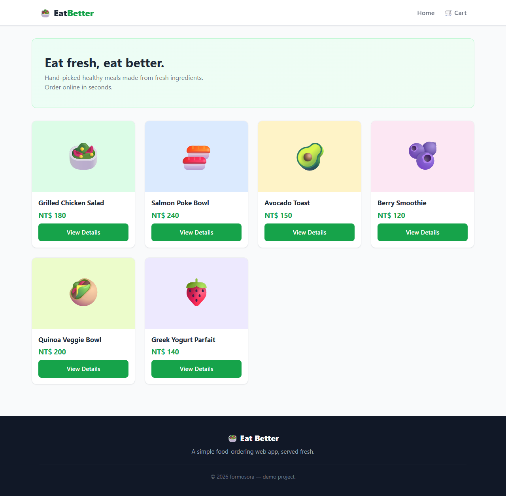
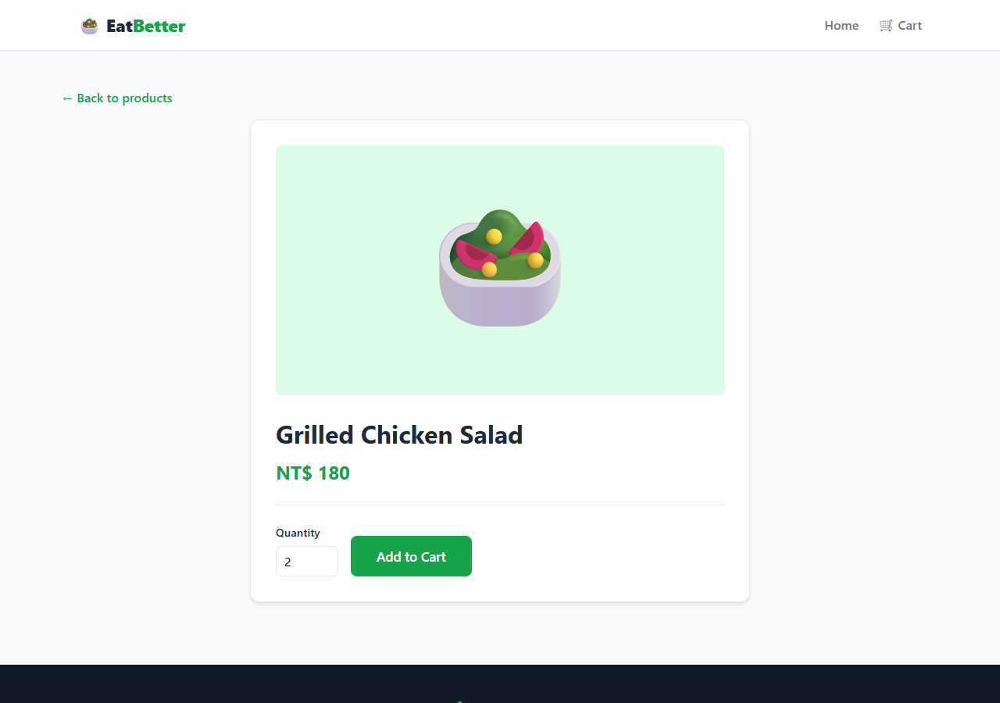
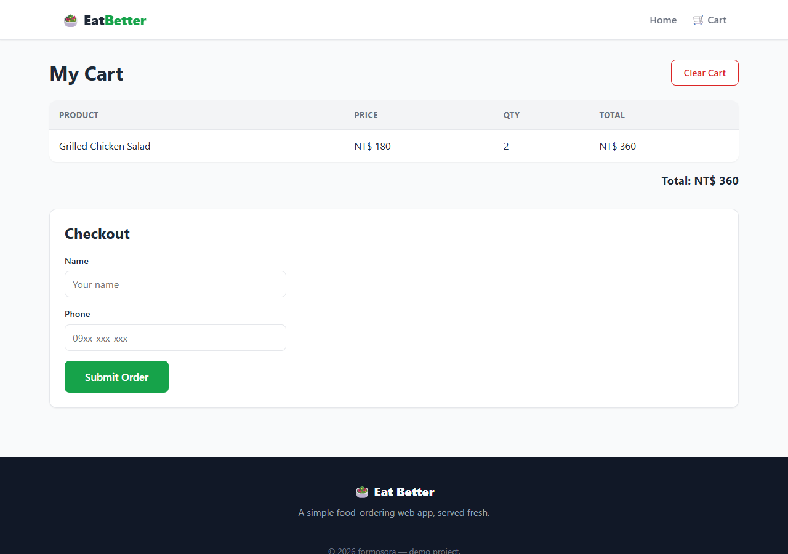
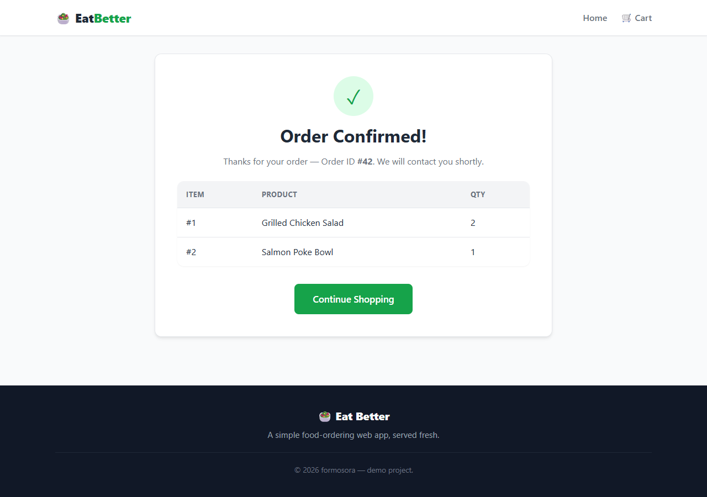

# 🥗 Eat Better

一个**简单的食物订购网页**：浏览菜单 → 加入购物车 → 免注册下单。React storefront + ASP.NET Core 无头 CMS 后端，单容器 Docker 部署。


## 📸 Screenshots

| Home | Product Detail |
| ---- | -------------- |
|  |  |

| Cart | Order Confirmed |
| ---- | --------------- |
|  |  |

## ✨ Features

- 🛍️ **Product catalog** with images, served live from the headless CMS
- 🛒 **Shopping cart** with quantity merging, persisted in `localStorage`
- 📦 **Guest checkout** — name + phone, no account required
- ✅ **Order confirmation** page with live line items from the backend
- 🐳 **Single-image deployment** — frontend build, API and SQLite in one container

## 🧱 Tech Stack

| Layer    | Technology |
| -------- | ---------- |
| Frontend | React 19, TypeScript, Vite 7, React Router 7 |
| Backend  | ASP.NET Core 9, [FormCMS](https://github.com/formosora/formcms) (headless CMS + auth) |
| Database | SQLite |
| DevOps   | Docker (multi-stage build) |

## 📁 Project Structure

```
eat-better/
├── backend/                 # ASP.NET Core + FormCMS API (port 5265)
│   ├── Program.cs           # CORS, CMS, auth and SPA fallback wiring
│   └── AppDbContext.cs      # Identity DbContext
├── frontend/                # React + TypeScript storefront (port 5173)
│   └── src/
│       ├── api.ts           # API client: products, orders, guest login
│       ├── cart.ts          # localStorage cart helpers
│       ├── types.ts         # Shared domain types
│       ├── components/      # Header / Footer / Layout
│       └── pages/           # Home / ProductDetail / Cart / OrderConfirm
└── Dockerfile               # frontend build → backend publish → runtime
```

## 🚀 Quick Start

Prerequisites: **.NET 9 SDK** and **Node.js LTS**.

### 1. Backend — http://localhost:5265

```bash
cd backend
dotnet run
```

### 2. Frontend — http://localhost:5173

```bash
cd frontend
npm install
npm run dev
```

The Vite dev server proxies `/api` and `/files` to the backend, so no CORS or
hard-coded hosts are needed. To type-check and produce a production build:

```bash
npm run build   # outputs to backend/wwwroot
```

## 🐳 Docker Deployment

```bash
docker build -t eat-better .

# Keep the SQLite database on a host volume so data survives updates
docker run -d \
  --name eat-better \
  --restart unless-stopped \
  -p 80:8080 \
  -v ~/eat-better-data:/app/data \
  -e ConnectionStrings__DefaultConnection="Data Source=data/cms.db" \
  eat-better
```

## 🔌 API Surface (used by the storefront)

| Endpoint | Purpose |
| -------- | ------- |
| `GET /api/queries/products` | List all products |
| `POST /api/login` | Guest sign-in (cookie session) |
| `POST /api/entities/order/insert` | Create an order |
| `GET /api/entities/collection/order/{id}/items` | Line items of an order |

## 🔑 Default CMS Accounts

Two demo accounts are seeded on first run (see `backend/Program.cs`):

- `sadmin@cms.com` / `Admin1!` (super admin)
- `admin@cms.com` / `Admin1!` (admin)

> ⚠️ These are **demo credentials** — change them before any real deployment.
